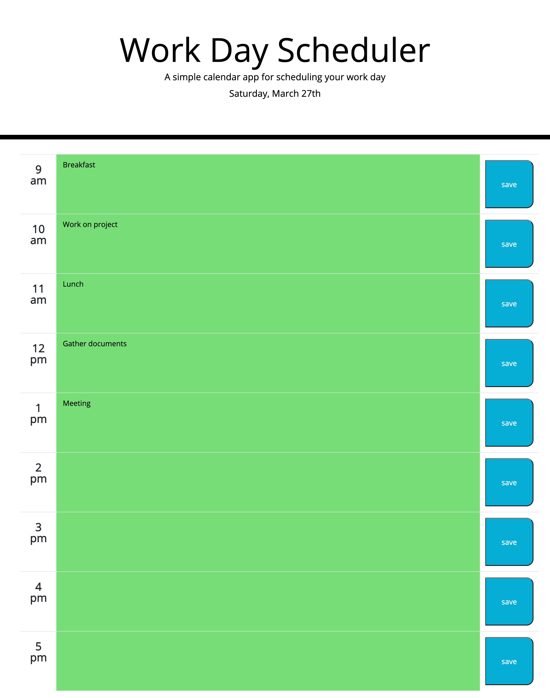

# work-day-scheduler

## Description

This is a a work day scheduler that displays the current date at the top. The scheduler allows the user to mark down their todo tasks for each hour of their day between 9am-5pm. When the user types in a task and presses the save button, the task will remain in that hour block. During the current hour, the corresponding hour row will turn red, all past hour rows will be gray, and all future hours will be green.

# Deployed Site

Here's the site:
[Deployed Site](https://jdinh3.github.io/work-day-scheduler/)
